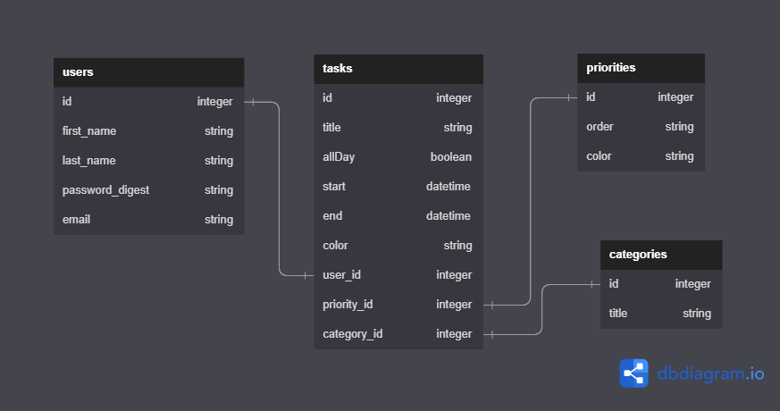

# Build-A-Habit

Building a good habit is important to stay focused and organized to optimize time efficiency. Creating a habit starts by creating scheduled tasks and executing tasks on a daily basis. 

## Description

Build-A-Habit is a React and Ruby on Rails application with integrated FullCalendar library. There are 4 models; User, Task, Category and Priority, with 5 client-side routing utilizing React Router. All routes follow RESTful conventions with the Task model having a full CRUD. User password protection and authentication are implemented with BCrypt gem and session hash cookies. Also, models include validation and error handling processes. Lastly, it is fully deployed on [Render: Build-A-Habit](https://build-a-habit.onrender.com).

### Model relationships diagram

The models have many-to-many relationships, Task model being a join table which has user_id, category_id and priority_id as foreign keys.

# 

## Getting started

Start by **cloning** the project

```console

$ git clone git@github.com:thyoon515/build-a-habit.git
$ cd build-a-habit

```

Furthermore, you must bundle install, create database in rails and install npm --prefix client by running,

```sh

bundle install
rails db:create
npm install --prefix client

```
Lastly, start psql service, run rails server and start npm --prefix client,

```sh

sudo service postgresql start
rails s
npm start --prefix client

```

## Thanks to:

- [dbdiagram.io](https://dbdiagram.io/home)
- [FlatironSchool](https://flatironschool.com/)
- [FullCalendar](https://fullcalendar.io/)
- [Video-to-gif](https://ezgif.com/video-to-gif)
- [MUI](https://mui.com/)
- [React](https://react.dev/)
- [Ruby on Rails](https://rubyonrails.org/)